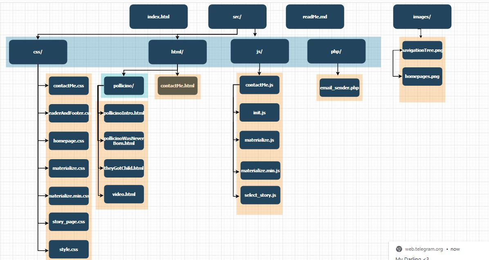
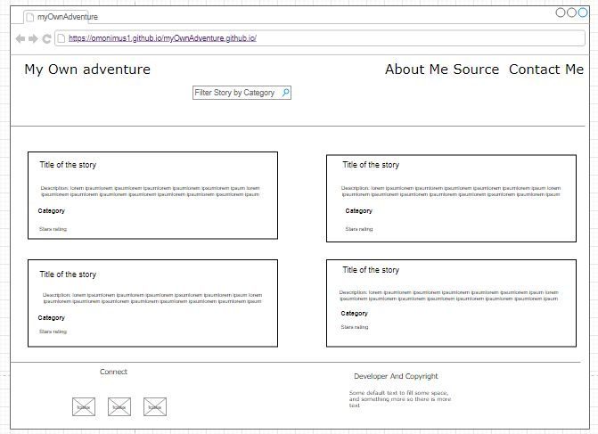
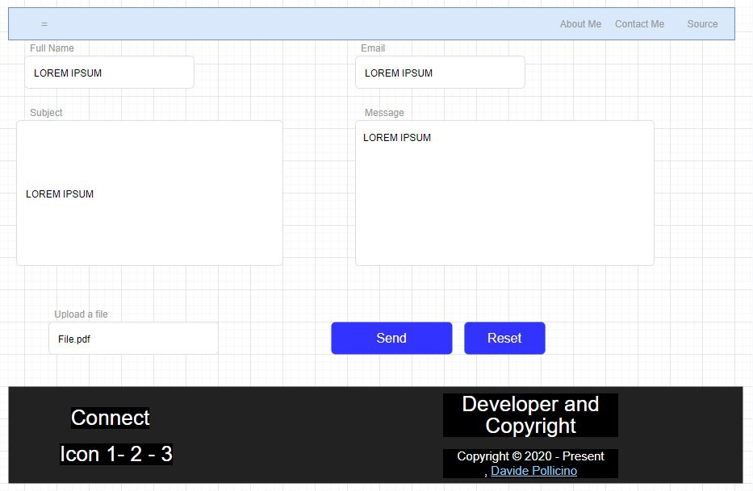

# myOwnAdventure.github.io

* [Link to the Website of the Coursework](https://omonimus1.github.io/myOwnAdventure.github.io/)

## Author

* Davide Pollicino - 40401270 
* ```40401270 at live dot napier dot ac dot uk```
* ```davidepollicino2015 at gmail dot com```
* [Personal Website](http://davidepollicino.com)


## Description of the Coursework

The goal of this coursework is to create a “choose your own adventure” style adventure game.
This is a type of game in which the player reads a sections of a story and is the then presented
with options about how the storyline develops. The player can reach different outcomes
depending upon the choices that they make so the storyline and endings can vary greatly
based upon their selections.
Technologies used

This WebTechonogies coursework has been deployed with the aim to master HTML, CSS, and
Javascript.

For the realization of this coursework, I have used:
* HTML 5 , CSS , JavaScript , php
* Materialize (CSS Framework).
* Vue.js (Javascript Framework)


## Description of the website and games

The homepage of the website will present multiple stories but just one of them for
development purposes, will be available to the user and Lecturer for the Coursework
demonstration session.
The story that I have decided to use, is based on the famous ​[Pollicino’s story](https://www.grimmstories.com/language.php?grimm=037&l=en&r=it)​, written by
Grimm brothers.


## Background Research for the website

Before to start to design and develop this website, I had to understand what actually means
“choose your own adventure”.
For this reason, doing some background research , I have been inspired by:

* [Example1](http://chooseyourstory.com/)
* [Example2](https://infinite-story.com/)

## Background Research For development purposes

During the development process, I came across to different points where I had to choose
between multiple ways to develop the same functionalities or actually How to implement it.
In the following section,you would find most of the research that have been extremely useful
to work on my Coursework.

* [What is a JS slider and how to modify it](https://www.w3schools.com/howto/howto_js_rangeslider.asp)
* [Stars rating system](https://codepen.io/jamesbarnett/pen/vlpkh)
* [Configuration of email_sender script in php](https://stackoverflow.com/questions/38299776/usr-sbin-sendmail-not-found/38299803)
* [Fix Materialize footer bottom-padding and sticky footer](https://stackoverflow.com/questions/29703544/materialize-css-sticky-footer)
* [Session cookies](https://www.qmsuk.com/cookies?gclid=Cj0KCQiAqNPyBRCjARIsAKA-WFyAXMA0U8iTzA5Fv1jg92snZnb1E8vUg6CsQgMTpVkWFQe2qfkc_MMaAoxWEALw_wcB)


## List of features of the website

* Enable black theme:​ Allows to the users to actually change the theme of the website
to help the users during the reading process or save as well battery life of the device,
using darker colors.
* Contact Form:​ developed to allow to the user to give a feedback about the website
and/or suggest a possible story.
* Category search​ : Implemented to allows to the user to filter the stories in according
with their category: Fantasy - Childhood- Horror. Once that other stories will be added ,
the users will be able to choose among a bigger set of story categories.
* Game play:​ actual interaction between the user and the game.


## Navigation Tree
I have decided to to adopt the following site map because:
* It reflects the positions of the files at the root level of the folder. Supposing that the
user is going to visit the repository of the website , the ReadMe file will be automatically
shown once the page of the repository is loaded.
* The index.html is as well at the root level because it is necessary for hosting purposed
and for testing executed in locally.
* The src contains different folders in according with the file format that they are going
to contain, to help me as well to find different files more easily.



## Sketches of the User Interface






